# حالات بصرية من اختبار النسخة الموقعة

الألوان: أحمر = حد ناشر البيانات، أصفر = AI، سماوي = الحد الخام المحسّن، أخضر = القص مع هامش 6 بكسلات المصدر. القياسات من Android؛ الرسم أُنشئ من الإحداثيات المسجلة دون إعادة الكشف.

## 060 — background02_datasheet001_frame_0056.jpeg

انحراف الحد الخام: 1.31 px. القص الداخلي: -0.84 px. المراجعة اليدوية: لم يطلبها الفحص.

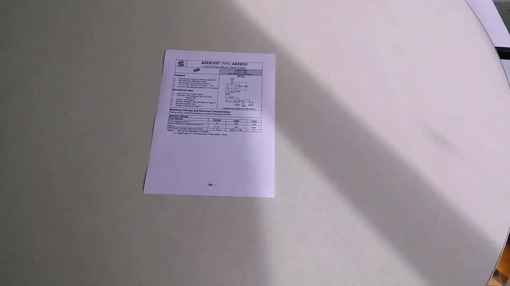

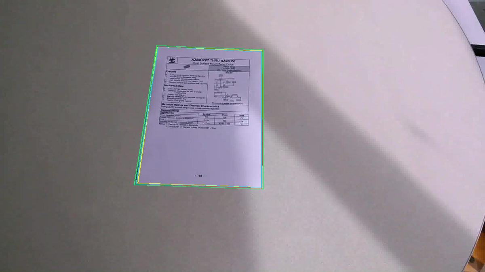

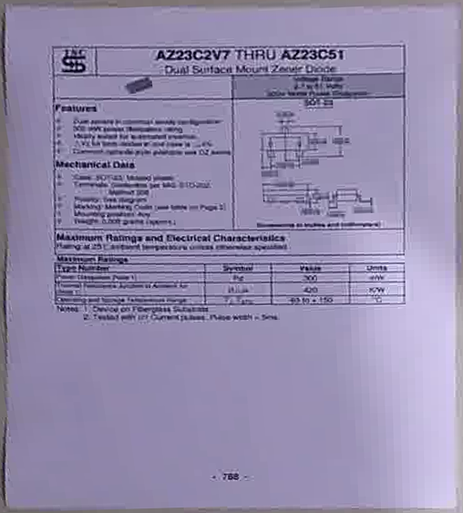

## 124 — background03_datasheet003_frame_0047.jpeg

انحراف الحد الخام: 2.04 px. القص الداخلي: 2.10 px. المراجعة اليدوية: مطلوبة.

تغير قرار الثقة في هذه الصورة الضبابية؛ لم تُغيّر الحدود لإخفاء الخطأ. عرض انتقال الحواف: 4 / 8 / 3 / 7 بكسلات مصدر.

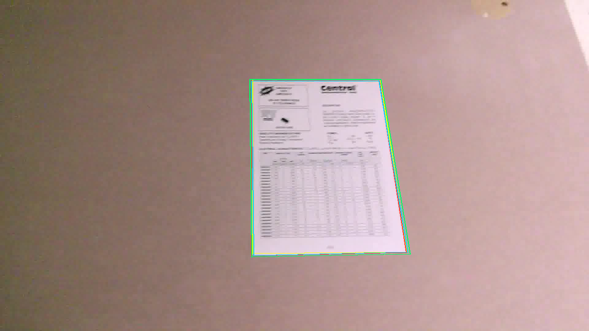

## 200 — background04_magazine001_frame_0039.jpeg

انحراف الحد الخام: 5.41 px. القص الداخلي: 13.96 px. المراجعة اليدوية: مطلوبة.

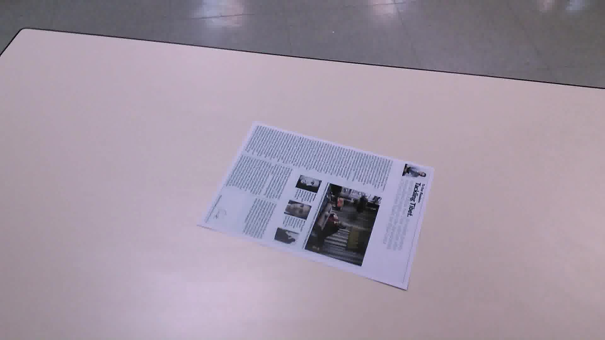

## 270 — background05_paper001_frame_0020.jpeg

انحراف الحد الخام: 6.32 px. القص الداخلي: 12.93 px. المراجعة اليدوية: مطلوبة.

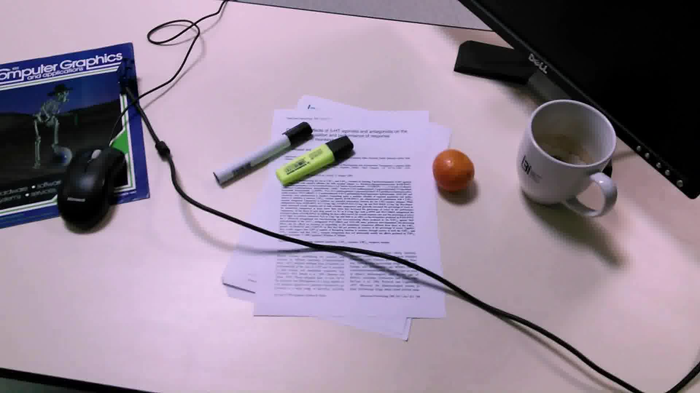

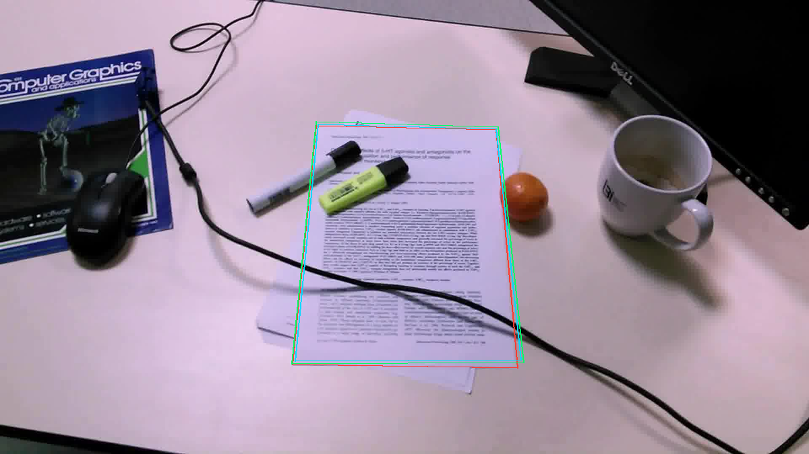

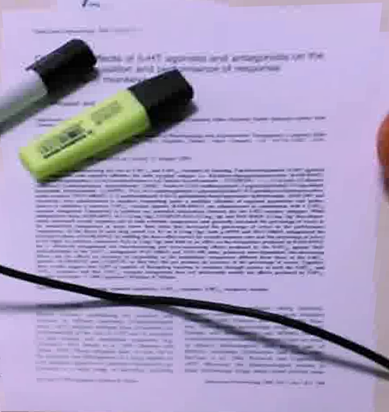

## 280 — background05_patent001_frame_0023.jpeg

انحراف الحد الخام: 13.62 px. القص الداخلي: 29.55 px. المراجعة اليدوية: مطلوبة.

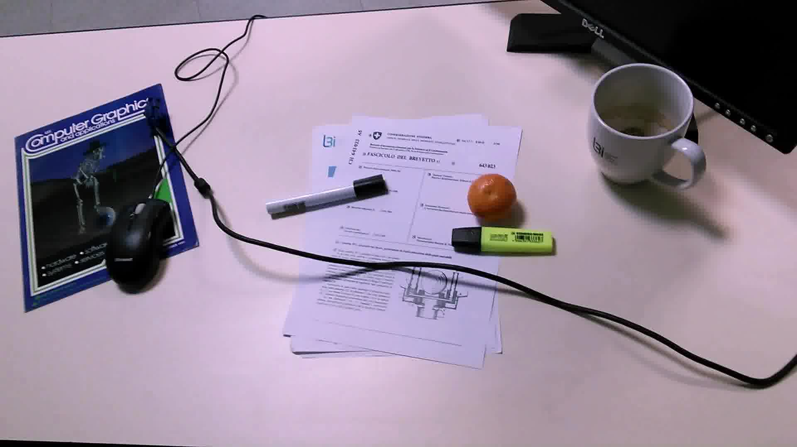

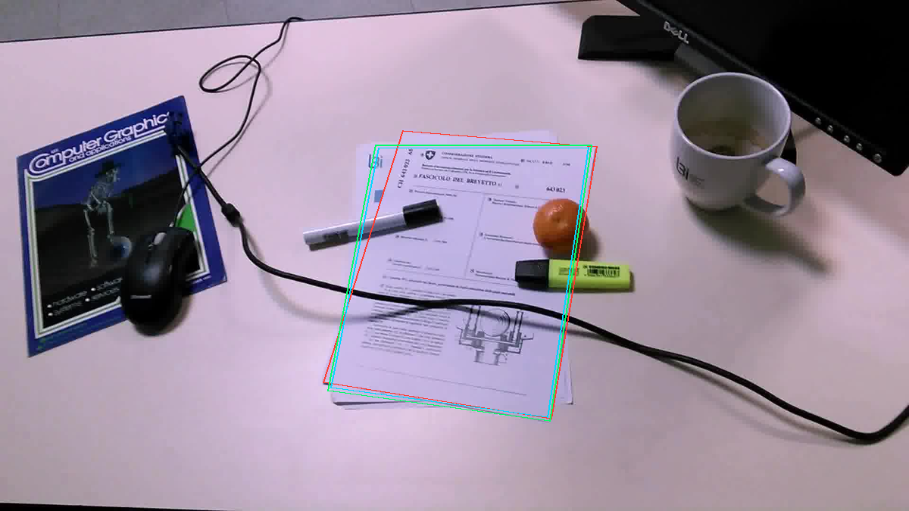

## 299 — background05_tax005_frame_0059.jpeg

انحراف الحد الخام: 3.90 px. القص الداخلي: 8.77 px. المراجعة اليدوية: مطلوبة.

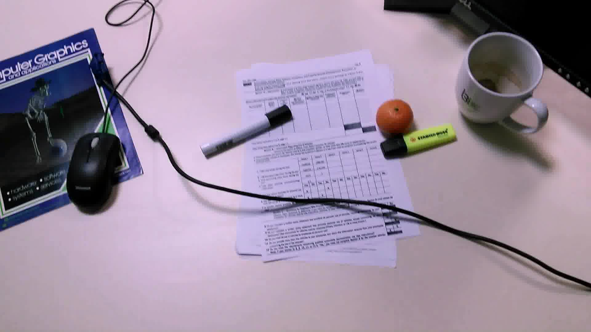

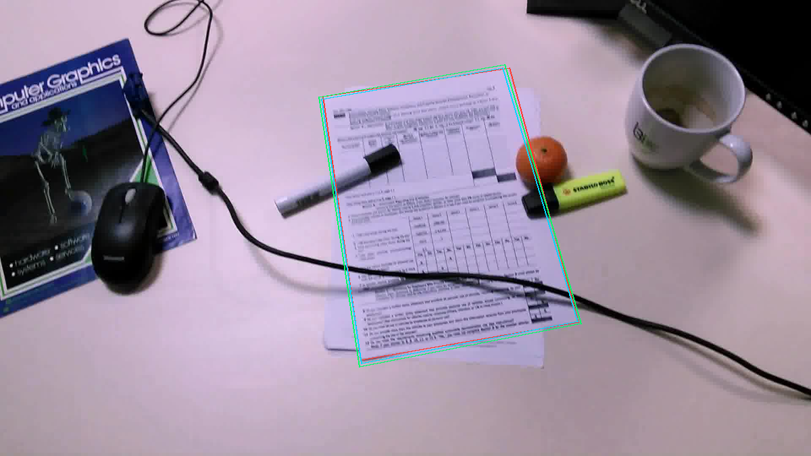

SmartDoc 2015 challenge 1 v2.0.0، CC-BY-4.0. الحقوق: Burie, Chazalon, Coustaty, Eskenazi, Luqman, Mehri, Nayef, Ogier, Un and Rusinol؛ ICDAR 2015 SmartDoc competition. [المصدر والرخصة](https://github.com/jchazalon/smartdoc15-ch1-dataset). لا تتضمن الصور أي مستند شخصي للمستخدم.
